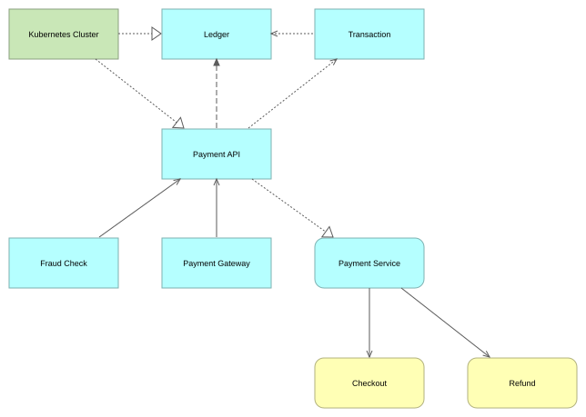

<h1 align="center">amcli</h1>

<p align="center">
  <b>ArchiMate models from the command line.</b><br>
  One static binary that reads, edits, validates and draws <code>.archimate</code> files directly.<br>
  No Archi, no JVM, no daemon. Built for AI agents, pleasant for humans.
</p>

<p align="center">
  <a href="https://github.com/arslan-gg/amcli/actions/workflows/ci.yml"></a>
  <a href="https://github.com/arslan-gg/amcli/releases/latest"></a>
  <a href="LICENSE"></a>
  <a href="https://agentskills.io"></a>
</p>

```console
$ amcli search payment -l 3
id-a47e7ccb…  ApplicationComponent  Payment API      /Application  3  3  1  name
id-96b26f68…  ApplicationComponent  Payment Gateway  /Application  0  1  1  name
id-9a5a25ad…  ApplicationService    Payment Service  /Application  1  2  1  name

$ amcli impact "Payment API" -D in            # what breaks if this changes?
$ amcli relation add Serving "Fraud Check" "Payment API"
$ amcli view auto "Payments" --from "Payment API" -n 3
$ amcli view render "Payments" -o payments.svg
```

<p align="center">
  
  <br>
  <sub>That view was placed by <code>amcli</code>: straight lines, nothing crossing, nothing hand-dragged.</sub>
</p>

## Why

- **Archi is a GUI.** Its command line (ACLI) loads, saves, imports and reports.
  It cannot search a model, walk its graph, edit one element, validate anything
  or export an image. The headless route is jArchi scripting — a full Archi
  install plus a JRE, and a fresh JavaScript file per question.
- **Nothing permissively licensed reads *and* writes the Archi format** with
  full fidelity. amcli does, and it is Apache-2.0.
- **Agents need a tool, not an app.** Tab-separated records, exit codes to
  branch on, atomic batches, and a skill that installs the binary itself.

## Highlights

- **Diffs a human can review.** Untouched bytes stay untouched — comments,
  whitespace, attribute order, all of it. Renaming one element changes one line:

  ```diff
  -    <element xsi:type="archimate:ApplicationComponent" name="Payment API" id="id-a47e7ccb…"/>
  +    <element xsi:type="archimate:ApplicationComponent" name="Payments API" id="id-a47e7ccb…"/>
  ```

- **Writes that cannot corrupt the model.** Every write is checked against
  Archi's own 62×62 relationship matrix and refused if the standard forbids it
  — naming what *is* allowed:

  ```console
  $ amcli relation add Composition "Transaction" "Checkout"
  error: ArchiMate does not permit Composition from DataObject to BusinessProcess
         — permitted here: Association
  ```

  Deletes cascade to every diagram object that referenced the concept, saves
  are atomic, and `--expect-checksum` refuses to write over a file that moved
  since you read it. Whatever amcli writes, Archi still opens.
- **One question, one call.** `search`, `get`, `trace`, `path`, `impact`,
  `cycles`, `query 'layer=Application and deg>10'`. Data on stdout, context on
  stderr, exit codes an agent can branch on: `3` not found, `4` ambiguous —
  both come back with something to retry.
- **Atomic batches.** `amcli apply` takes JSONL, resolves forward references
  between lines and writes once. If any line fails, the file is byte-identical.
- **Reproducible rebuilds.** Keep the batches in git and pass `--id-seed`: ids
  derive from what they name, so regenerating an unchanged model produces an
  unchanged file. `amcli export views` goes the other way — it derives the
  batch that rebuilds every view from the model, so a drawing gets a
  declarative form to review without a second source of truth to keep in step.
  Export, apply, and the file is byte-identical.
- **Views drawn to be read.** Layout works from the graph alone, tries several
  layerings and keeps the least tangled: every edge one straight line, kept off
  the boxes, boxes sized to their labels, and — wherever the graph allows it —
  nothing crossing. [How it works →](docs/layout.md) Past a dozen views, file
  them: `-f /Views/<name>` on `create` and `auto`, `view move` for the rest,
  and a view keeps its id when it moves.
- **Agent-ready.** Ships an [Agent Skill](https://agentskills.io) that teaches
  Claude Code, Codex and friends the workflow — and keeps the binary current
  every session.

## Install

**For an agent** — the skill installs and updates the binary itself:

```bash
npx skills add arslan-gg/amcli -y
```

**Just the binary** — checked against the release's SHA256SUMS before it is
unpacked, with no flag that skips that, into `~/.local/bin`, no `sudo`, no
shell config edited:

```bash
curl -fsSL https://raw.githubusercontent.com/arslan-gg/amcli/main/skills/amcli/scripts/install.sh | sh
```

```powershell
irm https://raw.githubusercontent.com/arslan-gg/amcli/main/skills/amcli/scripts/install.ps1 | iex
```

**From source** (Rust 1.90+; the only route for platforms without a prebuilt
binary — the installers fall back to it on their own):

```bash
cargo install --git https://github.com/arslan-gg/amcli --locked amcli-cli
```

Add `--tag vX.Y.Z` to build a release rather than the branch, which is what
the installers do when they take this route themselves.

Prebuilt for macOS (Apple silicon, Intel), Linux (x86_64, aarch64, static
musl) and Windows x64. `amcli skill install` writes the skill from the binary
if you went binary-first.

## A tour

```bash
amcli stats                                   # how big, and of what
amcli get "Payment API"                       # the concept and everything it touches
amcli trace "Payment API" -n 2                # the neighbourhood
amcli path "Web App" "Customer Database"      # how are these connected?
amcli query 'kind=element and view=0'         # modelled but drawn nowhere

amcli element  add ApplicationComponent "Refund Service" -f /Application
amcli relation add Access "Refund Service" "Refund Record" --access rw
amcli prop set "Refund Service" owner team-payments
amcli element  delete "Refund Service" -y     # cascades, and says to what

amcli apply batch.jsonl                       # many edits, one write, all or nothing
amcli validate                                # rules, with a `fix` per finding
amcli view auto "Refunds" --from "Refund Service" -n 2
amcli view move "Refunds" -f /Views/Payments  # file it; the id does not change
amcli export views                            # the batch that rebuilds every view
amcli export mermaid                          # a quick diagram for a chat window
```

`amcli --help` lists everything; `amcli <command> --help` goes deep. Reads are
bare verbs, writes are noun-verb, `--dry-run` and `--count` never write.

## Development

```bash
cargo test           # byte-identity over real Archi files, property tests, layout sweep
cargo xtask verify   # generated tables still match the vendored Archi assets
```

`tests/corpus/` is real Archi output; the identity test asserts that parsing and
writing every file is a byte-for-byte no-op. `assets/archi/` is vendored from
[archimatetool/archi](https://github.com/archimatetool/archi) (MIT) and turned
into the type tables and relationship matrix by `cargo xtask codegen`.

## Status

Read, write, validate, views and SVG all work and are tested. Not yet:
coArchi's grafico directory format, Open Exchange XML, and PNG output (render
to SVG and convert). No Homebrew tap on purpose — `brew` does not exist in the
containers agents run in.

## Licence and trademarks

Apache-2.0. See [NOTICE](NOTICE) for the vendored Archi assets and their MIT
licence.

ArchiMate® is a registered trademark of The Open Group. Archi® is a trademark
of Phillip Beauvoir. This project is independent and is not affiliated with,
endorsed by, or certified by either; it reads and writes their file formats for
interoperability.
